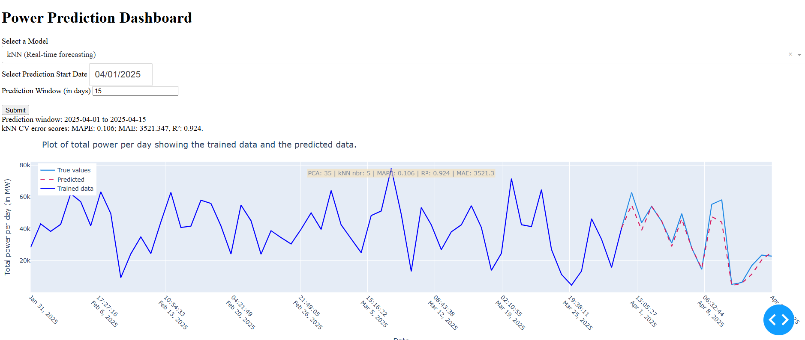
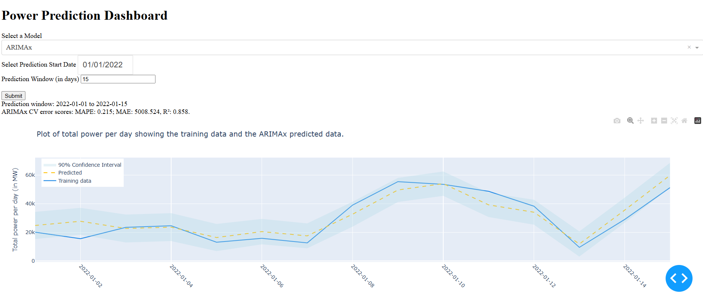

# Wind Power Forecasting

**The Erdős Institute Data Science Bootcamp Summer 2025**

**Team Members:**
- [Desmond Coles](https://www.linkedin.com/in/desmondcoles/)
- [Andrea Fodor](https://www.linkedin.com/in/anfodor/)
- [Kavinda Nissanka](https://www.linkedin.com/in/kavinda-nissanka/)
- [Manimugdha Saikia](https://www.linkedin.com/in/manimugdha-saikia-phd-54b455178/)
- [Jaxon Shumaker](https://www.linkedin.com/in/jaxon-shumaker-b661122a4/)

## Introduction
Wind power is the second-largest source of renewable energy for HydroQuébec, a public utility corporation that provides power to Canadians in Québec and exports to Northeast American Power Traders. Knowledge of day-ahead power forecasting is an essential metric for the company.  

## Goal

## Modeling Apprach
Wind power generated by a turbine is proportional to the area of the turbine, the wind speed cubed, and the inverse of the temperature measured in Kelvin. We utilized this data, along with the information on wind turbines from the Canadian government, to develop a new feature for each of the 39 locations.

From our exploratory data analysis steps, we realized that wind speed alone was one of the most essential features. Furthermore, Principal Component Analysis revealed that the explained variance was 98.8%, allowing us to significantly reduce our feature space.

We selected our models using the following cross-validation method: we trained them on data from 2019 to 2021 and then used them to predict values in the first six months of 2022. We then generated graphs of the predictions and calculated the MAPE, MAE, and R²-score.

## Best models
We select our best model based on MAPE, MAE, and R² Scores from the validation step. We maintained two models: one that treats the data as a time series and the other that does not. 
- kNN Regressor (Time-series agnostic): Performed best on both the training/validation set and the testing set. The kNN model is trained on the engineered feature: (wind speed)$^3$ divided by temperature (in Kelvin) for each wind farm. We train on hourly data, predict on hourly data, and then add the predicted values for the 24 hours to get the prediction on a particular day. Each prediction is based on a rolling 60-day training window.

- ARIMAx (Time-series observant): The ARIMA model with the mean daily wind speed added as an exogenous variable. Training is done on 60 days prior to the prediction date. The (p,d,q) parameters are chosen using auto_ARIMA. 

## Results

## Dash APP
An interactive *dash app* that allows the user to choose a model between **kNN Regressor** (with two options: i\) "Validation/Testing" running `kNN_script`, and ii\) "Real-time forecasting" running `kNN_real_time_script`) and **ARIMAx**, and input a prediction window. The difference between "kNN (Validation/Testing)" and "kNN (Real-time Forecasting)" is that the former, in theory, has all the necessary code to make a real-time forecast, given the user has access to the power data API key. 

 
,

